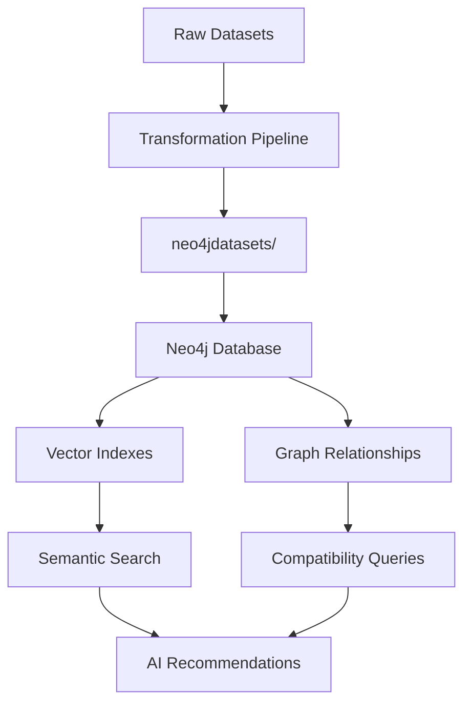

# Documentation Index

Comprehensive documentation for the Welding Recommendation System's data pipeline and Neo4j architecture.

---

## 📚 Documentation Overview

This documentation suite provides complete guidance for understanding, implementing, and maintaining the welding recommendation system's data infrastructure.

### **Target Audience**
- **Data Engineers** - Pipeline implementation and optimization
- **Backend Developers** - Neo4j integration and API development  
- **DevOps Engineers** - Deployment and infrastructure management
- **Business Analysts** - Understanding data transformations and business logic
- **System Architects** - Design decisions and scalability planning

---

## 📖 Document Structure

### **1. [Data Pipeline Architecture](./DATA_PIPELINE_ARCHITECTURE.md)**
**Comprehensive architectural overview and design decisions**

**📋 What's Covered:**
- **Data Flow Architecture** - Complete ETL pipeline overview
- **Transformation Logic** - Business rules and data processing
- **Neo4j Design Decisions** - Why graph database + vector search
- **Graph Schema Design** - Node types, relationships, indexes
- **Vector Embeddings Strategy** - Semantic search implementation
- **Performance Considerations** - Scalability and optimization
- **Future Roadmap** - Evolution and enhancement plans

**🎯 Best For:**
- Understanding the overall system architecture
- Making informed design decisions
- Planning system extensions
- Evaluating technology choices

**📊 Key Sections:**
- Why Neo4j? (Performance, relationships, vector integration)
- Graph schema with 384-dimensional embeddings
- Query patterns for recommendations
- Scalability from 100K to 1M+ products

---

### **2. [Technical Implementation Guide](./TECHNICAL_IMPLEMENTATION_GUIDE.md)**  
**Detailed technical procedures and operational guidance**

**📋 What's Covered:**
- **System Requirements** - Hardware, software, dependencies
- **Data Transformation Implementation** - Code examples and procedures
- **Neo4j Configuration** - Database setup and optimization
- **Loading Procedures** - Clean, incremental, specific file loading
- **Monitoring & Maintenance** - Health checks and performance monitoring
- **Troubleshooting Guide** - Common issues and solutions
- **Backup & Recovery** - Data protection procedures
- **Performance Tuning** - Optimization strategies

**🎯 Best For:**
- Implementing the system from scratch
- Troubleshooting operational issues
- Performance optimization
- Production deployment

**🔧 Key Sections:**
- Step-by-step Neo4j setup and configuration
- Complete code examples for data loading
- Performance monitoring and optimization
- Comprehensive troubleshooting procedures

---

## 🚀 Quick Start Guide

### **For New Implementers**
1. **Start with**: [Data Pipeline Architecture](./DATA_PIPELINE_ARCHITECTURE.md) - Overview
2. **Then read**: [Technical Implementation Guide](./TECHNICAL_IMPLEMENTATION_GUIDE.md) - Setup
3. **Use scripts**: `../scripts/` - Automated deployment

### **For Operators**
1. **Reference**: [Technical Implementation Guide](./TECHNICAL_IMPLEMENTATION_GUIDE.md) - Sections 5-8
2. **Monitor**: Performance monitoring procedures
3. **Troubleshoot**: Common issues and solutions

### **For Architects**  
1. **Study**: [Data Pipeline Architecture](./DATA_PIPELINE_ARCHITECTURE.md) - Design decisions
2. **Review**: Neo4j schema and query patterns
3. **Plan**: Scalability and future enhancements

---

## 🔍 Document Cross-References

### **Architecture ↔ Implementation**

| Architecture Topic | Implementation Details |
|-------------------|----------------------|
| Graph Schema Design | Neo4j Configuration (Tech Guide §3) |
| Vector Embeddings | Embedding Generation (Tech Guide §2.2) |
| Loading Strategy | Loading Procedures (Tech Guide §4) |
| Performance Design | Performance Tuning (Tech Guide §8) |
| Query Patterns | Query Optimization (Tech Guide §8.1) |

### **Common Use Cases**

| Task | Primary Document | Supporting Sections |
|------|-----------------|-------------------|
| **Initial Setup** | Tech Guide §1-4 | Architecture §2-3 |
| **Understanding Design** | Architecture §3-4 | Tech Guide §3 |
| **Performance Issues** | Tech Guide §6-8 | Architecture §7 |
| **Data Loading** | Tech Guide §4 | Architecture §5 |
| **Monitoring** | Tech Guide §5 | Architecture §7 |

---

## 📊 Key Metrics & Specifications

### **System Specifications**
```yaml
Database: Neo4j 5.13+
Vector Dimensions: 384 (all-MiniLM-L6-v2)
Index Types: Property + Vector + Composite
Query Performance: <100ms for recommendations
Data Scale: 100K products → 1M+ scalability
Loading Modes: Clean / Incremental / Specific
```

### **Performance Targets**
```yaml
Vector Search: <50ms for 10 results
Graph Traversal: <10ms for compatibility
Hybrid Queries: <100ms for recommendations
Bulk Loading: ~10 minutes complete refresh
Uptime: 99.9% availability target
```

---

## 🔄 Data Flow Summary



**Pipeline Stages:**
1. **Raw Data** (`Datasets/`) - Excel/CSV business data
2. **Transformation** - Clean, normalize, enhance with embeddings
3. **Staging** (`neo4jdatasets/`) - Graph-ready JSON format
4. **Loading** - Import into Neo4j with indexes
5. **Querying** - Hybrid graph + vector recommendations

---

## 🛠 Implementation Checklist

### **Initial Setup**
- [ ] Read [Data Pipeline Architecture](./DATA_PIPELINE_ARCHITECTURE.md) overview
- [ ] Review system requirements (Tech Guide §1)
- [ ] Install Neo4j and dependencies
- [ ] Configure database settings
- [ ] Set up Python environment

### **Data Pipeline**
- [ ] Understand transformation logic (Architecture §3)
- [ ] Configure data sources and outputs
- [ ] Run transformation pipeline (`scripts/transform_data.sh`)
- [ ] Load data into Neo4j (`scripts/load_data.sh`)
- [ ] Validate data integrity and performance

### **Production Deployment**
- [ ] Configure monitoring (Tech Guide §5)
- [ ] Set up backup procedures (Tech Guide §7)
- [ ] Implement performance tuning (Tech Guide §8)
- [ ] Test disaster recovery procedures
- [ ] Document operational procedures

---

## 📈 Maintenance Schedule

### **Daily**
- Monitor query performance and system health
- Check backup completion and integrity
- Review error logs and alerts

### **Weekly**  
- Analyze query patterns and optimization opportunities
- Update performance metrics and trending
- Review and clean up old backups

### **Monthly**
- Performance tuning and index optimization
- Capacity planning and scaling assessment
- Documentation updates and reviews

### **Quarterly**
- Architecture review and enhancement planning
- Disaster recovery testing
- Technology upgrade evaluation

---

## 🔗 Related Resources

### **External Documentation**
- [Neo4j Documentation](https://neo4j.com/docs/)
- [Neo4j Vector Index Guide](https://neo4j.com/docs/cypher-manual/current/indexes/semantic-indexes/)
- [Sentence Transformers](https://www.sbert.net/)

### **Project Resources**
- **Scripts**: `../scripts/` - Automated deployment tools
- **Backend**: `../backend/` - API implementation
- **Data**: `../backend/data/dt/` - Transformation tools

### **Support & Community**
- **Issues**: Project GitHub repository
- **Neo4j Community**: [Neo4j Community Forum](https://community.neo4j.com/)
- **Technical Support**: Internal development team

---

**Last Updated**: September 2025  
**Next Review**: December 2025  
**Document Maintainer**: Data Engineering Team